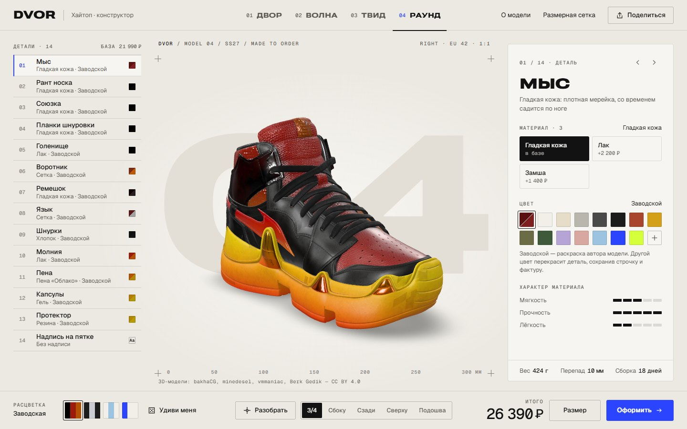
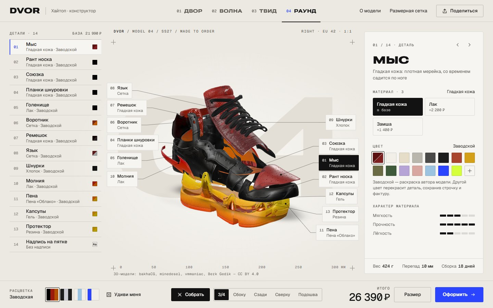
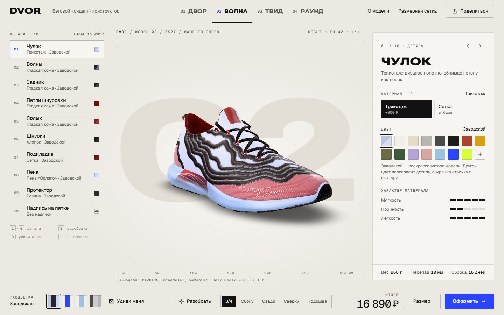
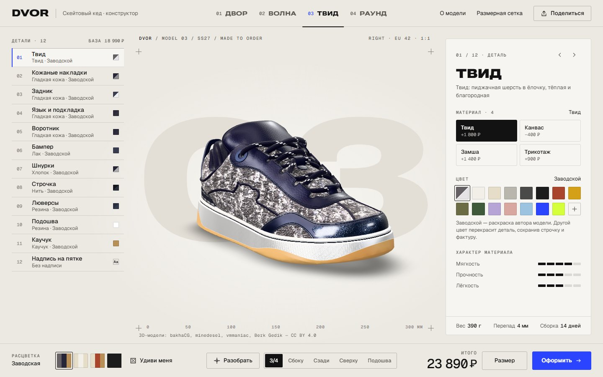
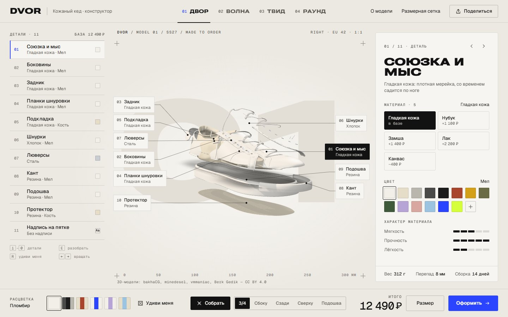
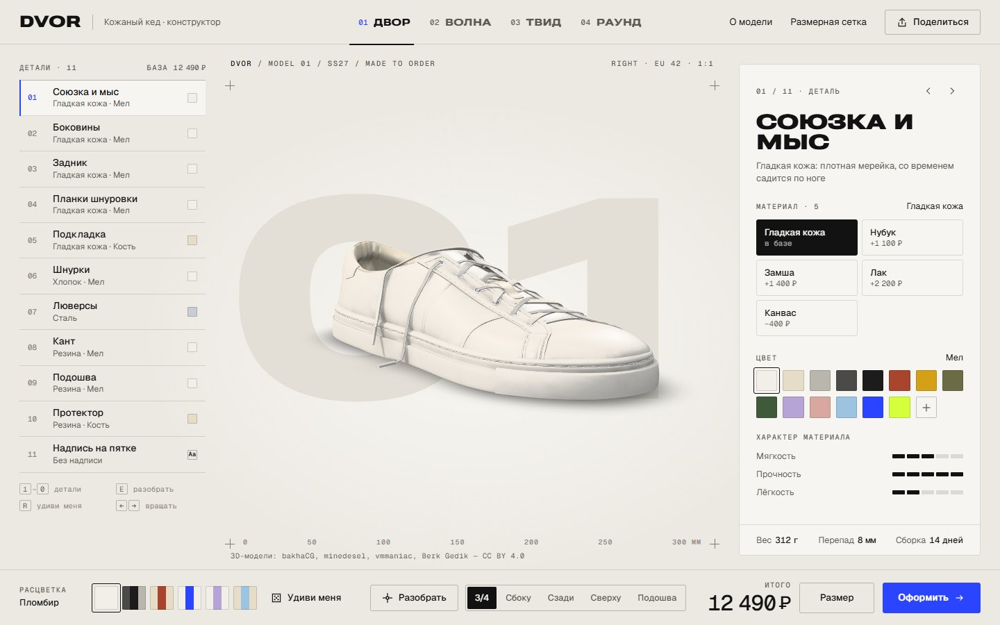
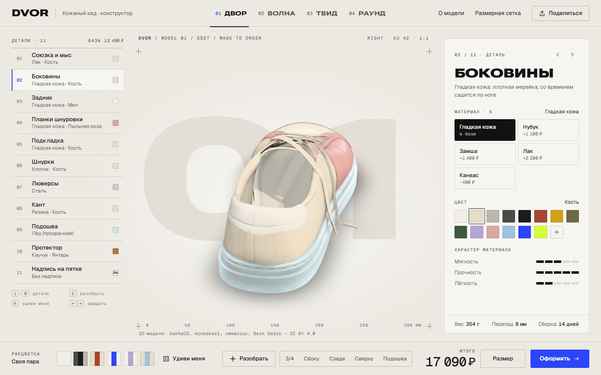
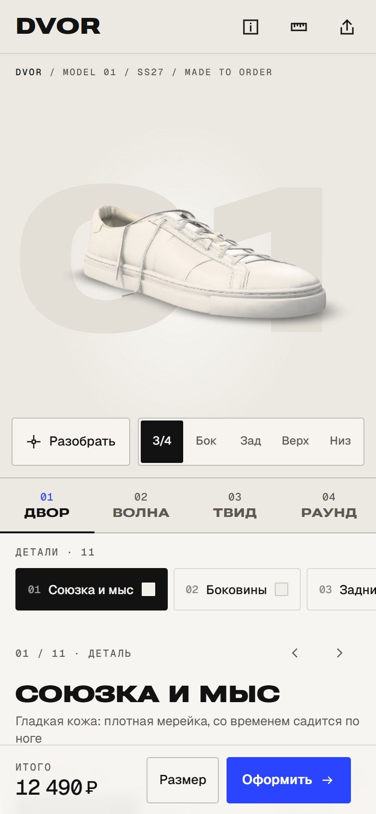
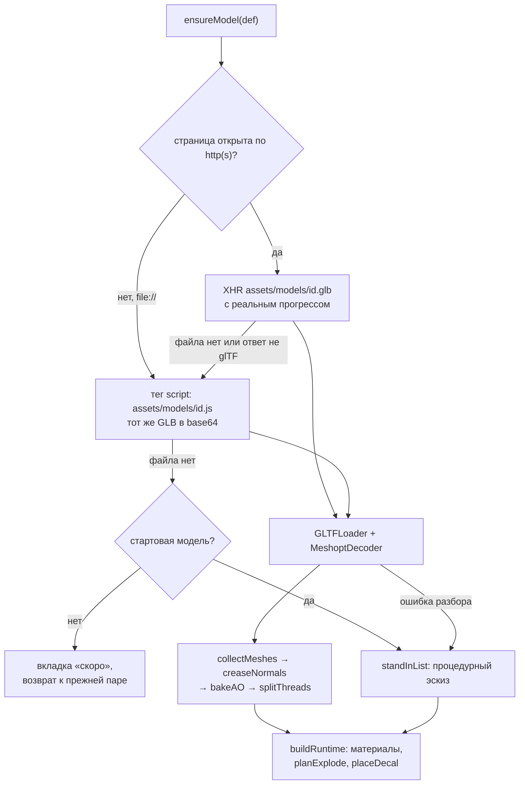

<p align="center">
  
</p>

# DVOR — 3D-конструктор кроссовок

> Конфигуратор кроссовок вымышленного бренда DVOR: четыре модели, в каждой от 9 до 13 деталей, которые можно перекрасить и перевести в другой материал. Пара вращается, разбирается на компоненты, получает надпись на пятке и уходит в демо-предзаказ с печатающимся чеком.


**Главное:**

- **Настоящие модели, разобранные на зоны.** Четыре glTF-модели с Sketchfab разбиты на 9–13 настраиваемых деталей. 24 PBR-материала получают процедурную фактуру прямо в шейдере, а модели с авторскими текстурами перекрашиваются без потери строчки и складок.
- **Разбор, как в техкарте.** Пара разлетается на компоненты по их центроидам, строчка летит вместе со своей панелью, у каждой детали появляется выноска с номером, названием и материалом.
- **Полный сценарий заказа без бэкенда.** Надпись на пятке через `DecalGeometry`, живые цена и вес, размер EU / US / см, чек с номером заказа и ссылка, по которой открывается та же пара. Страница работает даже с `file://`.

## Идея

DVOR выглядит как рабочий инструмент дизайнера обуви, а не как витрина магазина. Фон — технический лист: миллиметровая линейка до 300 мм, кроп-метки, подпись `DVOR / MODEL 01 / SS27 / MADE TO ORDER` и огромный номер модели, цифры которого прокручиваются при переключении. Детали пронумерованы, как в спецификации, а итог оформляется чеком из принтера.

Легенда бренда — двор панельной девятиэтажки: кеды сушатся на батарее, шнурки меняют на синюю изоленту. Отсюда палитра из 14 городских цветов («Мел», «Бетон», «Асфальт», «Сажа», «Кирпич», «Пыльная роза», «Кислота» и другие) и единственный акцент интерфейса `#2B44FF` — он же цвет «Синяя изолента». Даже загрузчик говорит на языке мастерской: «Раскраиваем кожу…», «Прошиваем швы…», «Вклеиваем подошву…», «Шнуруем…».

Проект показывает, как довести сторонние 3D-модели до продающего конфигуратора: разметить зоны, собрать библиотеку материалов, считать цену и вес, разбирать изделие на детали и делиться конфигурацией ссылкой. Он адресован брендам обуви, одежды, мебели и других товаров с вариантами исполнения, а также разработчикам, которым интересна техническая сторона конфигураторов на Three.js.

## Скриншоты

<table>
  <tr>
    <td width="50%" valign="top"><br><sub>Разбор пары на детали с выносками — модель 04 «Раунд»</sub></td>
    <td width="50%" valign="top"><br><sub>Модель 02 «Волна» — беговой концепт</sub></td>
  </tr>
  <tr>
    <td width="50%" valign="top"><br><sub>Модель 03 «Твид» — скейтовый кед</sub></td>
    <td width="50%" valign="top"><br><sub>Разбор модели 01 «Двор»</sub></td>
  </tr>
  <tr>
    <td width="50%" valign="top"><br><sub>Модель 01 «Двор» в заводской расцветке</sub></td>
    <td width="50%" valign="top"><br><sub>Случайная расцветка и выбор детали «Боковины»</sub></td>
  </tr>
</table>

<p align="center">
  
  <br><sub>Мобильная версия</sub>
</p>

## Возможности

### Коллекция

Переключатель моделей стоит в шапке, на телефоне — полосой вкладок над списком деталей. Модель загружается только при первом выборе, прогресс виден под вкладкой и над сценой. Уходящая пара разлетается и гаснет, новая собирается из разлёта. Настройки каждой модели сохраняются, пока вы переключаетесь между ними.

| № | Модель | Тип | Деталей | База | Вес EU 42 · перепад · сборка | Надпись на пятке | Расцветки |
|---|---|---|---|---|---|---|---|
| 01 | **Двор** | кожаный кед | 10 | 12 490 ₽ | 312 г · 8 мм · 14 дней | задник: фольга золото или серебро, тиснение | 6 |
| 02 | **Волна** | беговой концепт | 9 | 15 990 ₽ | 292 г · 10 мм · 16 дней | трикотажный чулок: печать, тиснение | 4 |
| 03 | **Твид** | скейтовый кед | 11 | 18 990 ₽ | 354 г · 4 мм · 14 дней | задник: фольга золото или серебро, тиснение | 4 |
| 04 | **Раунд** | хайтоп | 13 | 21 990 ₽ | 428 г · 10 мм · 18 дней | голенище: печать, тиснение | 4 |

У «Двора» нет авторских цветовых текстур: детали красятся из палитры, а карта нормалей кожи из исходника сохраняется в той мере, в какой подходит выбранному материалу. У «Волны», «Твида» и «Раунда» есть текстуры автора — для них в палитре появляется образец «Заводской», а любой другой цвет перекрашивает деталь поверх текстуры. Если файла модели нет, её вкладка помечается «скоро».

### Детали и материалы

- Слева — список деталей с номерами, текущим материалом и образцом цвета, последний пункт — «Надпись на пятке». Деталь выбирается кликом по модели, по строке или по выноске: камера подлетает к ней, а деталь вспыхивает контурной подсветкой. При наведении на модель рядом с курсором появляется ярлык с номером и названием детали.
- Справа — панель детали: описание материала, доступные материалы с надбавкой к цене, 14 цветов палитры, «Свой цвет» через системную пипетку и шкалы «Мягкость / Прочность / Лёгкость» от 1 до 5.
- У части материалов свой цвет: каучук — янтарный, «Лёд» — прозрачный, сталь, латунь и воронёная сталь — натуральные. Палитра для них блокируется с пояснением. Рефлектив по умолчанию серебряный, но его можно перекрасить.
- Каждой зоне доступны только уместные материалы: капсулы в подошве «Раунда» бывают гелевыми или хромовыми, строчка «Твида» — только нитью.

| Семейство | Материалы и надбавка | Как выглядит |
|---|---|---|
| Кожа | гладкая кожа (0), замша (+1 400 ₽), нубук (+1 100 ₽), лак (+2 200 ₽) | мерейка на ячейках Вороного, бархатистый ворс через `sheen`, зеркальный лак через `clearcoat` |
| Текстиль | сетка (0), трикотаж (+900 ₽), канвас (−400 ₽), твид (+1 800 ₽) | трипланарные узоры ячеек, вязки и плетения с рельефом; твид держится на авторской текстуре |
| Шнурки и нить | хлопок (0), вощёные (+300 ₽), рефлективные (+500 ₽), нить (0) | плоская тесьма, восковой блеск, светоотражающая крошка |
| Рефлектив | рефлектив (+2 600 ₽) | полуметалл с рисунком из бусин, загорается от «Вспышки» |
| Пена | «Облако» (0), «Облако+» (+1 900 ₽), крапчатая (+700 ₽) | поры EVA-пены, лёгкая иризация у «Облака+», чёрная крошка у крапчатой |
| Резина | резина (0), каучук (+900 ₽), «Лёд» (+1 500 ₽) | протектор, янтарный каучук, прозрачная резина с `transmission` |
| Металл | сталь (0), латунь (+600 ₽), воронёная сталь (+300 ₽) | люверсы с отражениями студии |
| Капсулы | гель (0), хром (+1 200 ₽) | прозрачный гель с преломлением, зеркальный хром |

### Расцветки и «Удиви меня»

- Готовые расцветки в нижней панели: у «Двора» шесть («Пломбир», «Асфальт», «Кирпич», «Синяя изолента», «Сирень», «Тополиный пух»), у остальных моделей по четыре, включая «Заводскую». Образец каждой показывает три ключевые детали модели.
- Детали перекрашиваются волной с шагом 60 мс, цвета плавно перетекают. Если ручная настройка совпала с расцветкой, та снова подсвечивается, иначе пара называется «Своя пара».
- «Удиви меня» собирает случайную, но осмысленную пару: нейтральная база, акцент из заданных пар-«партнёров» (`PARTNER`), тоновая или контрастная вторая краска, спокойная пена. Цвет каждой зоны выбирается по её роли (`ROLE`): база, отделка, акцент, подкладка, шнурки, пена, протектор.

### Разбор на детали

- «Разобрать» (или `E`) раскладывает пару: сначала отходят слои подошвы, затем детали верха снизу вверх, шнурки — последними, волной с шагом 45 мс.
- У каждой детали появляется выноска с номером, названием и текущим материалом, соединённая линией с точкой на её поверхности. На десктопе выноски выстраиваются в две колонки по бокам силуэта, на телефоне превращаются в номерные кружки, которые расталкивают друг друга до размера пальца.
- Камера сама отъезжает, чтобы разобранная пара и выноски поместились в свободную область экрана.

### Ракурсы и камера

- Пять ракурсов: 3/4, «Сбоку», «Сзади», «Сверху» и «Подошва» — в последнем пара наклоняется, показывая протектор. Выбор детали протектора сам переключает на этот вид.
- Каждый ракурс кадрируется по реальным габаритам модели, а не по фиксированным координатам.
- Пара вращается мышью или пальцем, масштабируется колесом или щипком в заданных пределах. Через 6 секунд бездействия она начинает медленно вращаться сама.
- Кнопка «Вспышка» появляется, только когда в паре есть рефлективный материал: экран вспыхивает белым, а рефлективные детали на мгновение загораются.

### Надпись на пятке

- До восьми знаков: латиница, кириллица, цифры, пробел, точка и дефис. Надпись появляется на модели прямо во время набора и стоит 790 ₽.
- Техника зависит от модели: горячая фольга золотом или серебром, тиснение тон в тон или контрастная печать, цвет которой подбирается по светлоте детали.
- Место для надписи находится автоматически на задней части нужной детали.

### Цена, вес и размер

- Итог в нижней панели пересчитывается при каждом изменении, цифры прокручиваются, как в механическом счётчике.
- «Паспорт пары» показывает вес для EU 42 с учётом материалов («Облако+» снимает 28 г, каучук добавляет 22 г), перепад и срок сборки.
- Размер выбирается во всплывающей сетке EU 36–47 с переключением EU / US / см. В шапке есть полная размерная сетка и совет, как измерить стопу.

### Предзаказ и ссылка

- «Оформить» без размера открывает сетку размеров и встряхивает её. С размером выезжает панель с принтером, из которого построчно «печатается» чек: база, каждая деталь с материалом, цветом и надбавкой, надпись, размер, срок сборки, итог и штрихкод.
- После подтверждения — экран «Заказ DV-01-XXXX принят». Номер — хэш конфигурации, поэтому одна и та же пара всегда получает один номер. Оплаты и личных данных нет.
- Вся конфигурация живёт в хэше адреса. «Поделиться» копирует ссылку, а если буфер обмена недоступен, показывает её в выделенном поле. Ссылка, вставленная в уже открытую вкладку, тоже подхватывается.
- В окне «О модели» — легенда, характеристики и благодарности авторам 3D-моделей со ссылками.

## Как это устроено

Весь проект — один `index.html` без сборки: разметка, стили и ES-модуль, который подключает Three.js 0.186 через import map.

### Реестр моделей и загрузка

Коллекция описана массивом `MODELS`: зоны (`Z(id, label, mats, def)`), разрешённые материалы, расцветки, характеристики и настройки надписи. Новая модель — это запись в `MODELS` и файлы в `assets/models/`. Меши в GLB называются по id зоны (допускается суффикс `__n`), `collectMeshes` раскладывает их по зонам и нормирует пару: длина 1 по оси X, подошва на `y = 0`.



- Ответ сервера проверяется по сигнатуре `glTF`, чтобы HTML-страница ошибки хостинга не ушла в парсер. При старте `probeModel` отправляет HEAD-запросы и помечает отсутствующие модели, ничего не скачивая.
- Готовый рантайм модели кэшируется в `RT`, поэтому возврат к уже открытой паре мгновенный, а исходные байты после разбора освобождаются.
- Процедурный эскиз `buildStandIn()` — кед, целиком построенный кодом: лофт подошвы с протектором-ёлочкой, верх из параметрических сечений с накладками и завальцованными краями, мягкий кант, язык, перекрёстная шнуровка и запечённое затенение. `STANDIN_MAP` сопоставляет его части зонам модели, которая не загрузилась, и конструктор продолжает работать.

### Подготовка геометрии

- GLB упакованы gltfpack с `EXT_meshopt_compression` и содержат только позиции и UV. Нормали строит `creaseNormals`: сглаживает через швы развёртки и оставляет жёсткими рёбра острее 50°.
- `bakeAO` запекает ambient occlusion в вершинный атрибут. Пара вокселизуется, из каждой вершины уходят 9 лучей в обе полусферы (побеждает более открытая, пол учитывается наполовину), затем два прохода сглаживания по треугольникам. При разборе затенение плавно гаснет: детали больше не закрывают друг друга.
- `splitThreads` делит меш шнурков и строчки на связные компоненты и по воксельной сетке определяет, на какой панели лежит каждый стежок. В разобранном виде строчка летит вместе со своей панелью, а шнурки — отдельно.
- `analyseZones` сэмплирует авторскую текстуру по треугольникам каждой зоны: 75-й перцентиль яркости становится опорным значением, средние тона дают двуцветный образец «Заводской».

### Материалы и шейдер

Материал — пресет параметров `MeshPhysicalMaterial` в `MATS` (шероховатость, металличность, `clearcoat`, `sheen`, `transmission`, `iridescence`) плюс параметры процедурной фактуры. Фактура дописывается в стандартный шейдер Three.js через `onBeforeCompile`, а общий `customProgramCacheKey` оставляет одну программу на все детали:

```js
sh.fragmentShader = sh.fragmentShader
  .replace('#include <common>', '#include <common>\n' + GLSL_PARS)
  .replace('#include <map_fragment>', '#include <map_fragment>\n' + GLSL_TINT)
  .replace('#include <color_fragment>', '#include <color_fragment>\n' + GLSL_ALBEDO)
  .replace('#include <roughnessmap_fragment>', '#include <roughnessmap_fragment>\n' + GLSL_ROUGH)
  .replace('#include <metalnessmap_fragment>', '#include <metalnessmap_fragment>\n' + GLSL_METAL)
  .replace('#include <normal_fragment_maps>', '#include <normal_fragment_maps>\n' + GLSL_NORMAL)
  .replace('#include <emissivemap_fragment>', '#include <emissivemap_fragment>\n' + GLSL_EMISSIVE);
```

- Узоры считаются в пространстве объекта (`dvPattern`): ячейки Вороного для кожи и рефлектива, шум для замши и нубука, трипланарные сетка, вязка и плетение, поры пены. Из высоты узора строится рельеф (`dvPerturb` по экранным производным), а по `fwidth` узор гасится на расстоянии, чтобы не мерцать.
- Перекраска текстурных деталей (`GLSL_TINT`): новый цвет умножается на отношение яркости текселя к опорной яркости зоны в степени 0,6. Строчка и складки остаются, а средние тона совпадают с образцом.
- Там же — затемнение внутренней стороны деталей, крапинки пены, френелевская подсветка при наведении и выборе и свечение рефлектива от «Вспышки».
- Студийный свет: ключевой, заполняющий и контровой источники, окружение `RoomEnvironment` через PMREM с разной силой отражений для кожи, металла и хрома, тонмаппинг `NeutralToneMapping`.

### Разлёт, выноски и камера

- `planExplode` берёт направление от центра пары к центроиду детали и смешивает его с подсказкой зоны из `EXPLODE_HINT` (`b` — направление, `w` — вес, `d` — дистанция). У модели могут быть свои поправки (`explode` в `MODELS`). Подошвы уходят вниз слоями.
- `surfaceAnchors` находит точки на поверхности детали лучами с четырёх сторон: центроид оболочки висит в пустоте, и выноска, нацеленная в него, попала бы в соседнюю деталь.
- `placeLabels` каждый кадр проецирует якоря на экран и расталкивает подписи, чтобы они не перекрывались.
- Ракурсы строит `fitDistance` по углам габаритов всех деталей в нужной позе: собранной, разобранной или наклонённой. `camera.setViewOffset` сдвигает центр проекции в свободную область между списком деталей и панелью, поэтому пара всегда стоит в центре видимого пространства.

### Надпись на пятке

`placeDecal` ищет место в четыре шага. Лучами сзади находит участки, где видна одна связная часть детали; для каждого измеряет ширину и выбирает самый просторный и самый задний; усредняет нормаль; затем проверяет сеткой 5 × 3 точки, что прямоугольник надписи лежит на той же части, смотрит наружу и укладывается в глубину проекции, а если нет — сдвигает и уменьшает его. Сотни лучей остаются дешёвыми благодаря `slabCaster`: треугольники задней части пары заранее разложены по сетке. Из `DecalGeometry` удаляются треугольники, смотрящие внутрь (`keepFacing`), а текст рисуется на `CanvasTexture` 1024 × 256 шрифтом Roboto Flex 900 и сжимается под ширину.

### Состояние, ссылка и производительность

- Конфигурация кодируется в `#c.<base64url(JSON)>` с полями `v`, `m`, `z`, `t`, `s`, `sz`. Каждая зона — пара «индекс материала, цвет», где цвет — индекс палитры, `s` (серебро), `f` (заводской), `l` (фиксированный) или hex. `decodeState` проверяет каждое поле, адрес обновляется через `history.replaceState` с задержкой 250 мс. Алфавит ссылки переживает хостинги, которые пропускают в якоре только `[A-Za-z0-9._~-]`.
- Тени пересчитываются, только когда детали двигаются: у карты теней ключевого света `autoUpdate = false`, контактная тень (глубина снизу и два прохода размытия) рендерится по флагу `shadowDirty`.
- На сенсорных экранах и при ширине меньше 768 px включается облегчённый режим `IS_LIGHT`: плотность пикселей до 1,5, карта теней 1024, текстуры ужимаются до 1024 px, прозрачные материалы заменяются полупрозрачностью без преломления.
- Шейдеры компилируются до того, как исчезнет загрузчик (`compileAsync` при поддержке `KHR_parallel_shader_compile`). Если телефон теряет WebGL-контекст, страница предупреждает и после восстановления пересобирает окружение и тени.

## Дизайн

- **Палитра.** Бумага `#ECE9E3` (фон), `#F7F5F1` (панели), `#E2DED6` (наведение), `#E3DFD7` (номер модели на фоне), `#FBFAF7` (чек). Чернила `#121212`, `#5C5852`, `#8A857D`. Единственный акцент — «синяя изолента» `#2B44FF`, при наведении `#1F35E0`.
- **Шрифты.** Roboto Flex с осями ширины 151 и оптического размера 144 при весе 900 — сверхширокий дисплейный для вордмарка, номеров, заголовков и надписи на пятке. Geist — интерфейс. Geist Mono с табличными цифрами — цены, номера деталей и подписи капсом.
- **Сетка.** На десктопе: шапка 64 px, список деталей 268 px слева, панель 348 px справа, нижняя панель 80 px, а 3D-сцена центрируется в пространстве между ними. Брейкпоинты по высоте экрана уплотняют список деталей и переносят «паспорт пары» в подвал панели.
- **Движение.** Сборка пары с «приземлением» подошвы, волна перекраски, счётчики цены и номера модели, печать чека по шагам, встряхивание при ошибке. Общая кривая — `cubic-bezier(.2,.75,.1,1)`.
- **Мобильная версия.** До 1024 px сцена занимает верх экрана, под ней шторка: детали и материалы листаются горизонтально, расцветки подписаны, цена, размер и «Оформить» закреплены внизу с учётом safe area. Диалоги и чек на телефоне открываются на весь экран.
- **Доступность.** `aria-pressed`, `aria-current` и `aria-live` для выбора и цены, загрузчик с `role="progressbar"`, нативные `<dialog>`. При открытом чеке основной интерфейс получает `inert`, после закрытия фокус возвращается на место. Переключатель коллекции работает как roving tabindex: стрелки только переводят фокус, а загрузку модели запускает `Enter`. При `prefers-reduced-motion` анимации становятся мгновенными, автоповорот и интро отключаются, «Вспышка» приглушается.
- **Язык.** Интерфейс на русском: склонения через `plural()`, цены с узким неразрывным пробелом и знаком «−» для скидок.

## Управление

| Действие | Мышь и клавиатура | Сенсор |
|---|---|---|
| Вращать пару | перетаскивание; `←` `→` — поворот на 20°, `↑` `↓` — наклон | один палец |
| Масштаб | колесо | щипок |
| Выбрать деталь | клик по детали, строке списка или выноске | тап |
| Деталь по номеру | `1`–`9`, `0` — десятая | — |
| Соседняя деталь | стрелки в шапке панели | те же кнопки |
| Разобрать или собрать | `E`, кнопка «Разобрать» | кнопка под сценой |
| Удиви меня | `R` | кнопка в шторке |
| Ракурс | 3/4, «Сбоку», «Сзади», «Сверху», «Подошва» | кнопки под сценой |
| Вернуться к 3/4 | клик по логотипу DVOR | тап по логотипу |
| Модель коллекции | `←` `→` `Home` `End` — фокус, `Enter` или `Space` — выбрать | тап по вкладке |
| Закрыть чек или выбор размера | `Esc` | крестик или тап по фону |

Горячие клавиши не срабатывают, пока фокус в поле ввода или диалоге.

## Стек

| Технология | Версия | Для чего |
|---|---|---|
| Three.js | 0.186.1 | рендер, `MeshPhysicalMaterial`, тени, `OrbitControls` |
| GLTFLoader + MeshoptDecoder | three/addons 0.186.1 | загрузка GLB со сжатием `EXT_meshopt_compression` |
| DecalGeometry | three/addons 0.186.1 | проекция надписи на пятку |
| RoomEnvironment + PMREMGenerator | three/addons 0.186.1 | студийное окружение для отражений |
| BufferGeometryUtils | three/addons 0.186.1 | `mergeGeometries` и `mergeVertices` для процедурного эскиза |
| GSAP | 3.15.0 | таймлайны сборки и разлёта, перелёты камеры, перекраска |
| GLSL | — | расширение PBR-шейдера, контактная тень, размытие |
| gltfpack | 1.2 | упаковка моделей (указан в метаданных GLB) |
| Google Fonts | — | Roboto Flex, Geist, Geist Mono |
| HTML, CSS, JavaScript | ES-модули, import map | без сборщика и npm-зависимостей |

## Структура проекта

```
3Д КРОССОВКИ/
├── index.html                # вся страница: разметка, стили и модуль (~3 700 строк)
├── assets/
│   └── models/
│       ├── dvor01.glb        # 01 «Двор», 1,2 МБ
│       ├── dvor02.glb        # 02 «Волна», 2,9 МБ
│       ├── dvor03.glb        # 03 «Твид», 5,2 МБ
│       ├── dvor04.glb        # 04 «Раунд», 4,3 МБ
│       └── dvor01–04.js      # те же GLB в base64 для запуска с file://
├── .gitignore
└── README.md
```

Внутри `index.html` код разбит на секции с заголовками-комментариями: данные (`MATS`, `COLORS`, `MODELS`), состояние и цены, шейдер материалов, процедурный эскиз, загрузка моделей, сцена и контактная тень, разлёт и выноски, камера, подсветка и выбор, надпись, интерфейс, ссылка, размеры, диалоги, заказ, коллекция, клавиатура, загрузчик, QA-хуки и запуск.

## Запуск

Нужен браузер с WebGL 2 и интернет: Three.js, GSAP и шрифты грузятся с CDN.

```bash
cd "3Д КРОССОВКИ"
python -m http.server 8000
```

Затем открыть http://localhost:8000. Через сервер модели `.glb` грузятся с настоящим прогрессом загрузки. Можно и просто открыть `index.html` двойным кликом: страница переключится на встроенные base64-копии моделей, они примерно на треть тяжелее, а прогресс для них расчётный.

Для проверки состояний есть параметр `?qa=`: например, `?qa=explode`, `?qa=model=dvor04`, `?qa=done`, `?qa=missing=dvor02` (вкладка «скоро») или `?qa=broken=dvor03` (процедурный эскиз). Параметры можно повторять: `?qa=model=dvor03&qa=explode`.

## Авторы 3D-моделей

Модели разбиты на детали и перенастроены для конструктора. Исходники распространяются по лицензии [CC BY 4.0](https://creativecommons.org/licenses/by/4.0/):

| Модель | Исходник | Автор |
|---|---|---|
| 01 Двор | [Men or Women Shoes Sneakers](https://sketchfab.com/3d-models/men-or-women-shoes-sneakers-e5bd0afceb2745619f4f2eabdcb73b1d) | bakhaCG |
| 02 Волна | [Running Shoe Concept](https://sketchfab.com/3d-models/running-shoe-concept-71e1243ea5ae4de5b904e09e92b0c898) | minedesel |
| 03 Твид | [Zapatilla Skater B9S](https://sketchfab.com/3d-models/zapatilla-skater-b9s-like-if-download-c97fbd9bc1804cac8297227fdec6f558) | vmmaniac |
| 04 Раунд | [RTFKTCHALLENGE — Paul Theme (Tekken)](https://sketchfab.com/3d-models/rtfktchallenge-paul-theme-tekken-70359e9596354126b3fa791d342276ab), на основе RTFKT Creator One | Berk Gedik |

Исходные архивы моделей (`refs/*.zip`) в репозиторий не входят: они слишком большие для GitHub, а скачать их можно по ссылкам выше.

---

Концепт для портфолио. Бренд DVOR вымышлен.
